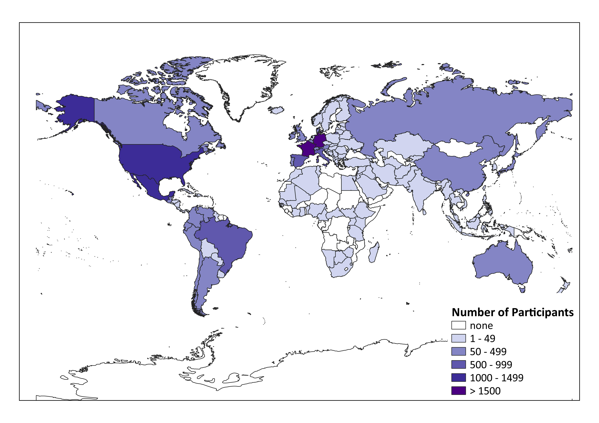

1. First we [wrangled the data](01_datawrangling.html).
2. We [decided which data to keep](02_exclusion.html). See the [codebook](03_codebook.html) for further details
3. Then we [looked at some descriptives](04_descriptives.html).
4. The main analyses: We [analyzed](05_analyses.html) effects of right-wing political orientation on preferred relationship options and partner preferences.
5. Then we [ran some robustness analyses](06_robustness_analyses.html) additionally including age as a covariate in each model.
6. Additionally, we [conducted exploratory analyses](09_analyses_exploratory.html) as we we were interested in the heterogeneity in relationships between countries.
7. Finally, we provided some [supplementary analyses](12_supplement.html) with a focus on preferred relationship options.

#### Authors of this Website
Lena Kuschel (lena.kuschel@stud.uni-goetttingen.de)
Laura Botzet (botzet@uni-goettingen.de)

